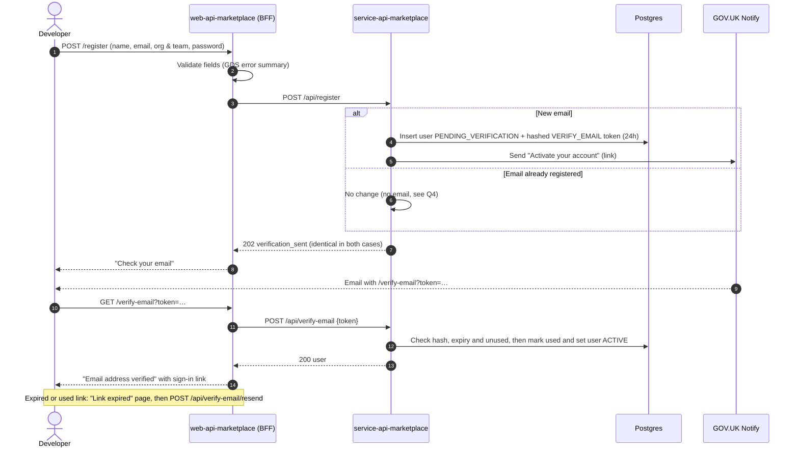
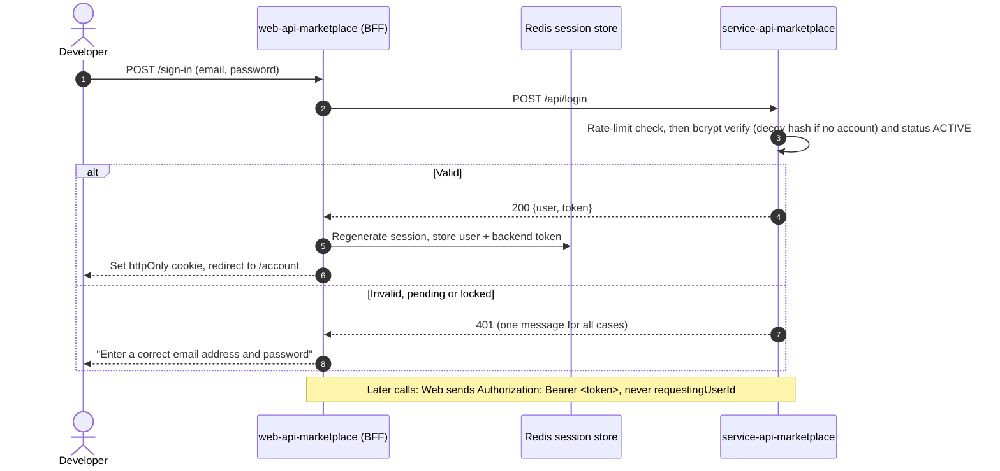
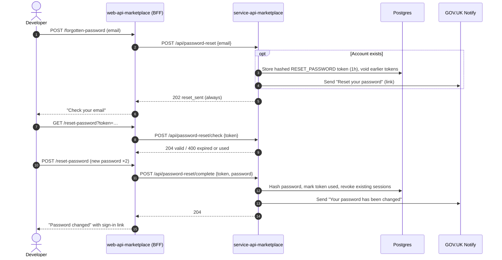

# ADR 0001 — Developer accounts: marketplace-owned credentials, verified by email through GOV.UK Notify

| | |
|---|---|
| **Status** | Accepted |
| **Date** | 6 October 2026 |
| **Deciders** | HMCTS API Marketplace |
| **Related** | `web-api-marketplace`, the frontend that consumes this decision. |
| **Epic** | User Registration UI: Create a developer account, Verify email, Sign in, Forgotten password |

## Context

The hosted marketplace needs real developer accounts. The epic asks for four journeys:

1. **Create a developer account**: first name, last name, email address, organisation and team,
   password and confirmation. The "I am registering as consumer / producer" question is removed.
2. **Verify email**: an "Activate your account" email with a link. The account only becomes usable
   once the link is followed.
3. **Sign in**: the page is unchanged, but it must be backed by a real service.
4. **Forgotten password**: the page is unchanged, but today **no email is sent**, and it must be.

What exists today:

| | `web-api-marketplace` (Express, Nunjucks) | `service-api-marketplace` (Spring Boot, Postgres) |
|---|---|---|
| **Today (`master`)** | All the pages exist. Register, verify and reset run against **accounts stored locally in the frontend** (scrypt hashes in Redis or memory). The email is only shown on screen; nothing is sent. Sign-in falls back to a backend stub that **does not check the password**. | `/api/register`, `/api/login`, `/api/logout` and `/api/me`. bcrypt (cost 12) user table, 7-day HS256 JWT, no email. Register returns 409 on a duplicate, which reveals that the account exists. |

This ADR decides where developer identity lives, how email addresses are verified and how
passwords are reset, and the conditions attached to that choice.

## Decision

**`service-api-marketplace` is the identity service for developer accounts. It stores credentials
in its own Postgres database and sends all account email through GOV.UK Notify. `web-api-marketplace`
is a backend-for-frontend (BFF): it renders the GOV.UK pages and owns the browser session, but holds
no credentials and sends no email.**

Each point is marked:

- **Existing**: already on `master`; the design keeps it.
- **New**: decided by this ADR, to be built.

1. **Credentials** live only in `service-api-marketplace`.
   - *Existing:* bcrypt cost 12, with the 72-byte limit enforced.
   - *New:* the frontend's local account store is removed.
2. **Account lifecycle.**
   - *New:* registering creates a `PENDING_VERIFICATION` account. It cannot sign in, and it
     becomes `ACTIVE` only when its verification link is used. This meets the "account created only
     after verification" requirement as a *usable account*. See open question Q1.
   - *New:* pending accounts that are never verified are deleted after 7 days.
3. **Email** goes through **GOV.UK Notify** only, with templates owned by the marketplace team.
   - *New:* "Activate your account", "Reset your password" and "Your password has been changed"
     templates. The activation template carries the epic's wording, including the phishing guidance.
4. **One-time tokens.**
   - *New:* 32 random bytes, and only their SHA-256 hash is stored. Each is single use.
     Verify links last 24 hours and reset links 1 hour. Issuing a new token voids the previous one.
5. **No account enumeration.**
   - *Existing:* sign in gives one error for every failure, with matching timing.
   - *New:* register, resend and forgotten password always return `202` with the same body. This
     replaces the existing 409 that register returns for a known email.
6. **Session model (BFF).**
   - *Existing:* the browser holds only an httpOnly session cookie. The session is kept in Redis on
     sandbox, but AAT and demo are not yet wired.
   - *New:* the backend token is stored in the server-side session and sent as
     `Authorization: Bearer` on every backend call. The backend derives the caller from it, and the
     `requestingUserId` header is withdrawn.
7. **Tokens never go in URL paths on the API.**
   - *New:* reset links are checked with `POST /api/password-reset/check`, with the token in the
     body, so it can't leak into ingress or access logs.

The sequence diagrams show the target design.

### Sequence: create an account and verify the email

### Sequence: sign in

### Sequence: forgotten password

## Trade-offs

| | For | Against |
|---|---|---|
| **Marketplace-owned credentials + GOV.UK Notify** | Builds on the existing account table and bcrypt hashing. Full control of GOV.UK pages and email wording. Notify is the government standard. No dependency on another team's tenant. | HMCTS owns password security: lockout, revocation, breached-password checks and IT Health Check scope. A second password for developers to manage. |

## Consequences

- **Positive:** one owner for identity, journeys match the epic exactly, real verification and
  reset emails, and the frontend loses its credential store.
- **Negative:** the service now carries password-handling obligations. These **must be in place
  before go-live**, and are tracked as backend stories, not nice-to-haves:
  - per-account and per-email throttling (the IP limiter is in-memory and per replica)
  - revoking sessions on password reset
  - a shared rate-limit store before running more than one replica
  - `JWT_SECRET` and `NOTIFY_API_KEY` in Key Vault for every environment
  - removing the unauthenticated `GET /users` and the legacy `/login` stub
- **Revisit trigger:** if MFA becomes mandatory, or the service is accredited for public live,
  re-assess a managed identity provider (for example Microsoft Entra External ID) in a
  superseding ADR. The BFF boundary keeps that swap contained.
- **Follow-up ADR candidate:** frontend-to-backend trust, meaning a user token alone versus a user
  token plus an S2S/Entra client credential (`web-api-marketplace` `CNP-ONBOARDING-PLAN.md` item 6.5).

## Compliance notes

- **UK GDPR:** processes name, work email and organisation. The privacy notice and ROPA entry must
  name Notify as a processor. Pending accounts are deleted after 7 days. Retention for inactive
  accounts is still to be set (Q3).
- **Security:** no plaintext tokens or passwords at rest or in logs. Emails are masked in logs.
  The decision depends on the CSRF protection on the frontend's state-changing forms, which is
  currently missing.
- **Accessibility:** journeys use GOV.UK Frontend components (error summary, password input with
  `autocomplete="new-password"`).

## Open questions

These are delivery details. None of them changes the decision above.

| # | Question | TBD |
|---|---|---|
| Q1 | Does "account created only after verification" allow a `PENDING_VERIFICATION` row, or must nothing be stored until the link is used? | Nagashankar.Ponnaganti@HMCTS.NET |
| Q2 | "Organisation and team": one free-text field (as today) or two? Is organisation chosen from a list? | Nagashankar.Ponnaganti@HMCTS.NET |
| Q3 | Retention period for unused accounts, and the account deletion journey (`/account/delete-request` today only records a request). | Nagashankar.Ponnaganti@HMCTS.NET |
| Q4 | Registering with an email that already exists: send nothing, or send "you already have an account"? The second is safer for the real owner. | Nagashankar.Ponnaganti@HMCTS.NET |
| Q5 | Role: with the consumer/producer question removed, how is producer capability granted later? The existing code defaults `role` to consumer. | Nagashankar.Ponnaganti@HMCTS.NET |
| Q6 | Password policy: keep a 12-character minimum with no complexity rules (NCSC-aligned), and add a breached-password check? | Security |
| Q7 | Is an email domain allowlist required (for example `*.gov.uk` and approved suppliers only)? | Nagashankar.Ponnaganti@HMCTS.NET |
| Q8 | Which Notify service and sender, and who owns the templates and API keys per environment? | Marketplace team |
| Q9 | Session lifetime: 20 minutes rolling in the frontend against a 7-day backend token. Align them? | Colin.Greenwood@HMCTS.NET |
